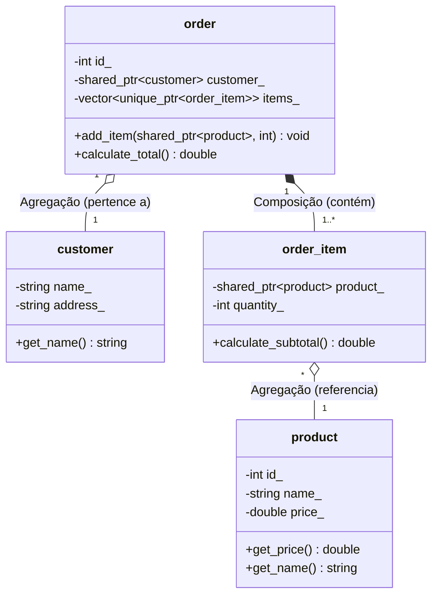

# Sistema-de-delivery

**Nome:** Luis Fernando De araújo Oliveira.
**Matricula:** 20250019090.

**Descrição de dominio:** O sistema gerencia cliente, produtos do cardapio e o processamento de pedidos, permitindo a adição de varios itens com quantidades específicas e o calculo do valor total da comprar.

# Diagrama UML

#Relações e Ciclo de Vida

**Composição** (order -- order_item): A classe dona (order) cria os itens dependentes internamente. Se o pedido for destruído, os itens do pedido deixam de existir.

**Agregação** (order o-- customer e order_item o-- product): Os clientes e produtos existem independentemente no sistema de delivery, mesmo que um pedido específico seja deletado.