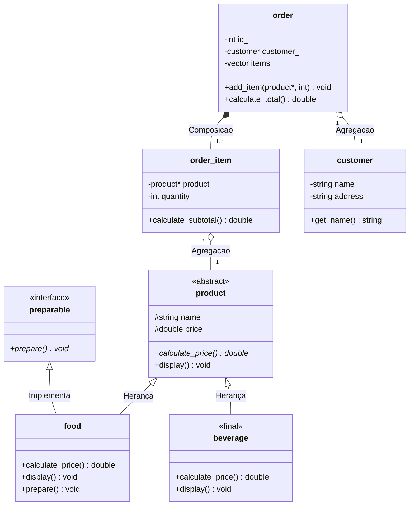

# Sistema-de-delivery

**Nome:** Luis Fernando De araújo Oliveira.
**Matricula:** 20250019090.

**Descrição de dominio:** O sistema gerencia cliente, produtos do cardapio e o processamento de pedidos, permitindo a adição de varios itens com quantidades específicas e o calculo do valor total da comprar.

# Diagrama UML

# Herança Avançada

A classe `beverage` (bebida) foi marcada com a palavra-chave `final`[cite: 1]. Isso garante, em nível de design, que nenhuma outra classe possa herdar dela[cite: 1]. No domínio deste sistema de delivery, uma bebida representa o nível máximo de especialização de um produto pronto (não requerendo subcategorias complexas de preparação como a comida), protegendo o sistema contra extensões indevidas dessa classe[cite: 1].

# Relações e Ciclo de Vida

*   **Composição** (`order` $--$ `order_item`): A classe dona (`order`) cria os itens dependentes internamente. Se o pedido for destruído, os itens do pedido deixam de existir.
*   **Agregação** (`order` $\circ--$ `customer` e `order_item` $\circ--$ `product`): Os clientes e produtos existem independentemente no sistema de delivery, mesmo que um pedido específico seja deletado.

# Herança Avançada

A classe `beverage` (bebida) foi marcada com a palavra-chave `final`. Isso garante, em nível de design, que nenhuma outra classe possa herdar dela. No domínio deste sistema de delivery, uma bebida representa o nível máximo de especialização de um produto pronto (não requerendo subcategorias complexas de preparação como a comida), protegendo o sistema contra extensões indevidas dessa classe.

# Relações e Ciclo de Vida

* **Composição** (`order` -- `order_item`): A classe dona (`order`) cria os itens dependentes internamente. Se o pedido for destruído, os itens do pedido deixam de existir.
* **Agregação** (`order` o-- `customer` e `order_item` o-- `product`): Os clientes e produtos existem independentemente no sistema de delivery, mesmo que um pedido específico seja deletado.

# Programação Genérica

* **Template Abstraído:** A classe `generic_registry<T>` abstrai o armazenamento e o cálculo genérico de itens que possuem precificação no sistema.
* **CRTP vs Herança Virtual:** O mixin `counted<Derived>` foi utilizado via CRTP para realizar a contagem de instâncias ativas em tempo de compilação, eliminando o custo de tabela virtual (vtable) e chamadas indiretas.
* **Pipeline de Ranges vs Laço Tradicional:** O uso do pipeline `catalog_map_ | views::filter(...) | views::transform(...)` permite encadear operações declarativas e preguiçosas (*lazy evaluation*), evitando a criação de vetores intermediários manuais e tornando o código mais limpo em relação a um laço `for` tradicional.

# SOLID

* **S (Single Responsibility Principle):** A classe `product` é responsável apenas pelas regras do produto, enquanto a persistência foi refatorada para a hierarquia de `repository`.
* **O (Open/Closed Principle):** A interface pura `preparable` e a base `product` permitem estender novas categorias de produtos sem modificar as classes existentes.
* **L (Liskov Substitution Principle):** `food` e `beverage` podem substituir `product` de forma transparente no sistema.
* **I (Interface Segregation Principle):** A interface `preparable` segrega a capacidade de preparação na cozinha apenas para produtos que a exigem.
* **D (Dependency Inversion Principle):** A classe `delivery_system` depende da abstração `repository`, recebendo-a por injeção no construtor.

# Concorrência e Thread Sanitizer

A operação `delivery_system::process_prices_in_parallel()` executa os cálculos de preço de forma independente usando `std::async`. As regiões críticas de acumulação do resultado são protegidas por `std::mutex` e `std::lock_guard`, garantindo execução limpa sem *data races* (verificado via `-fsanitize=thread`).