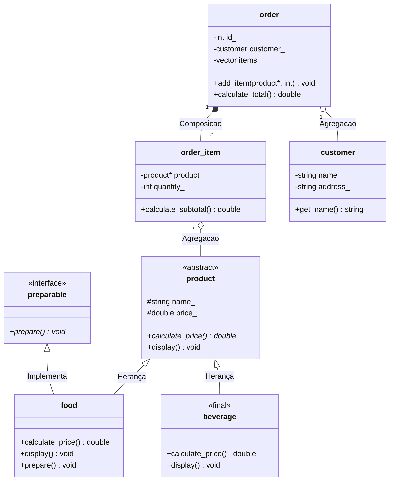

# Sistema-de-delivery

**Nome:** Luis Fernando De araújo Oliveira.
**Matricula:** 20250019090.

**Descrição de dominio:** O sistema gerencia cliente, produtos do cardapio e o processamento de pedidos, permitindo a adição de varios itens com quantidades específicas e o calculo do valor total da comprar.

# Diagrama UML

# Herança Avançada

A classe `beverage` (bebida) foi marcada com a palavra-chave `final`[cite: 1]. Isso garante, em nível de design, que nenhuma outra classe possa herdar dela[cite: 1]. No domínio deste sistema de delivery, uma bebida representa o nível máximo de especialização de um produto pronto (não requerendo subcategorias complexas de preparação como a comida), protegendo o sistema contra extensões indevidas dessa classe[cite: 1].

# Relações e Ciclo de Vida

*   **Composição** (`order` $--$ `order_item`): A classe dona (`order`) cria os itens dependentes internamente. Se o pedido for destruído, os itens do pedido deixam de existir.
*   **Agregação** (`order` $\circ--$ `customer` e `order_item` $\circ--$ `product`): Os clientes e produtos existem independentemente no sistema de delivery, mesmo que um pedido específico seja deletado.
